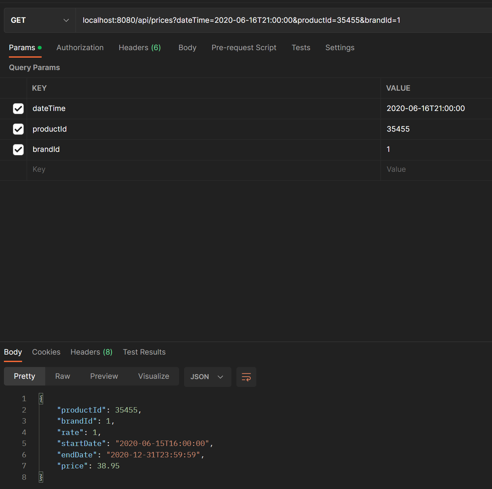

# Product management service

# Ejemplo de request y response en Postman



# Features

- Se insertan registros en la base de datos en memoria H2 de forma automática mediante el archivo data.sql
- Validación de la request
- Test unitarios a la capa de servicios según lo que se solicitó

## Requerimiento

Acepte como parámetros de entrada: fecha de aplicación, identificador de producto, identificador de cadena.
Devuelva como datos de salida: identificador de producto, identificador de cadena, tarifa a aplicar, fechas de aplicación y precio final a aplicar.

Nota 1: se asume que para la salida, la tarifa a aplicar corresponde a la prioridad, esto ya que el precio se asigna en otra variable.

Nota 2: se asume que el id de la cadena corresponde al brandId
# Instalación

Para ejecutar una aplicación de Spring Boot con comandos de Maven, primero asegúrate de tener Maven y Java 17 instalado en tu sistema. Luego, ve a la carpeta donde se encuentra el archivo pom.xml del proyecto y ejecuta los siguientes comandos:

```shell
mvn clean install -DskipTests=true
```

```shell
mvn spring-boot:run
```

O bien puede ser compilando y ejecutado con tu IDE favorito.


